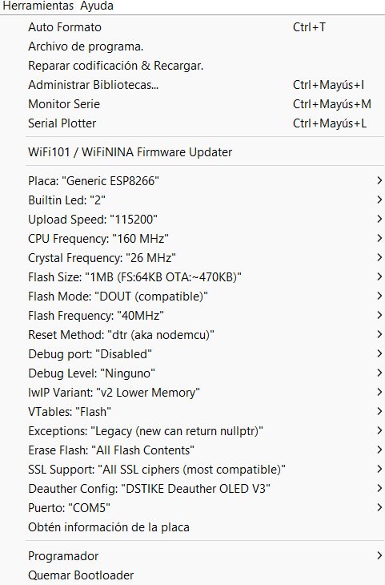

# WiFi Deauther & OpenWeatherMap Station

### I purchased one of these, just for fun:

(DSTIKE&SPACEHUHN Deauther V3)

### Then I found this:

(ThingPulse WeatherStation based on OpenWeatherMap API and several hardware setups)

### ... The conclusion is easy to guess: Why not joining both?

If you want to know more, take a look to the original source code and documentation:

- [SpaceHuhn/Deauther](https://github.com/SpacehuhnTech/esp8266_deauther)
- [ThingPulse/WeatherStation](https://github.com/ThingPulse/esp8266-weather-station/tree/master)

---

## Set it Up

You will need:

- Development Environment (Arduino IDE recommended)
- Source code (from this repository or, if you prefer/need to make your own integration, from the original reps)
- Arduino ESP8266 board and OLED Display (DSTIKE/SPACEHUHN watch or any other compatible hardware combination)
- [Optional] OpenWeatherMap API Key (free). All other features work without this, but no weather data will be downloaded/shown
- Modify WeatherStation.h (Settings section) according to your needs

To set up everything, follow the instructions in [here](https://deauther.com/docs/diy/installation-arduino) and/or [here](https://docs.thingpulse.com/how-tos/Arduino-IDE-for-ESP8266/)

## Install it

You can upload the source, as it is or modified, to your own hardware:

1. Connect your hardware using the USB plug
2. Double click "esp8266_deauther.ino" file. Arduino IDE will open (if properly installed)
3. Configure board options under Tools menu option. This configuration worked in my case (please note that "Port: COM5" might be different in your system):

     

4. Click "Upload" button/option
5. Wait until it finishes (compile -> upload)
6. Your hardware will automatically reset and run new uploaded software if everything went OK
7. Connect Serial Monitor (under "Tools" menu option) if you need to debug your changes

## Use it

- At startup, the watch will try to connect to the given WiFi network

- If the connection is successful, it will try to update time (from NTP server) and weather (from OpenWeatherMap)

- It will also perform an initial scan of other networks and devices around (just scan)

- If everything went OK, you will be shown the initial screen. At this first startup:

    - If all data is incorrect, more likely the watch could not connect to a WiFi
    - If only time is not correct, press SELECT button to exit to "Clock Menu", then select and press SET CLOCK option to manually change time using UP/DOWN buttons
    - If only weather is not correct, probably your OpenWeatherMap key is wrong, or the WiFi connection failed

- The first screen is actually a carousel, containing three frames:

    - Time and Date clock
    - Current weather
    - Weather forecasts for next 3 days

- It will automatically pass from one frame to the next, in a cycle mode

- To move to a given frame just press UP/DOWN button. If so, auto-animation will stop, remaining fixed in the selected frame

- To restore auto-animation back, press-hold UP/DOWN button, or exit to the "Clock Menu" (press SELECT button) then enter again in CLOCK mode

- It's possible to manually force updating weather data. To do so, exit to "Clock Menu" (press SELECT button) and select "UPDATE CLOCK" option 

- To access "Main Menu", first access "Clock Menu" by pressing SELECT button, then select and press "BACK" option

- From the main menu, you can access the Deauther options (explained in detail [here](https://deauther.com/docs/diy/installation-arduino)):

    - Scan
    - Select
    - Attack
    - Packet Monitor
    - Clock (this option is actually the initial screen you are shown at startup)
    - Led
